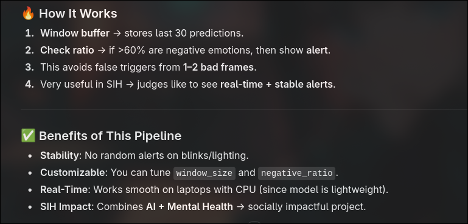

# Hugging Face Depression Detection 🧠

This project uses a Hugging Face emotion classification model combined with **OpenCV** to analyze live webcam feeds and detect possible signs of depression or distress based on facial emotions.  

If the system consistently detects **negative emotions** (e.g., sadness, fear, anger), it raises a visual alert.

---

## 🚀 Features
- Live **webcam-based facial emotion detection**.
- Uses **Hugging Face model**: [`dima806/facial_emotions_image_detection`](https://huggingface.co/dima806/facial_emotions_image_detection).
- Tracks emotions over a **rolling window** to avoid false alerts.
- Raises alerts when negative emotions dominate (>60%).

---



## 📂 Repository Structure
|___


---

## ⚙️ Installation

1. Clone the repository:
   ```bash
   git clone https://github.com/amandx36/face-depression-detection.git
   cd VISIONPIPELINESIH


 Create a virtual environment (optional but recommended):
 python -m venv venv
source venv/bin/activate   # Linux/Mac
venv\Scripts\activate      # Windows

Install dependencies:
pip install -r requirements.txt


Press q to quit the webcam window.

If negative emotions (sad, fear, angry) dominate over time, the app will show:

⚠ ALERT: Possible Distress!

